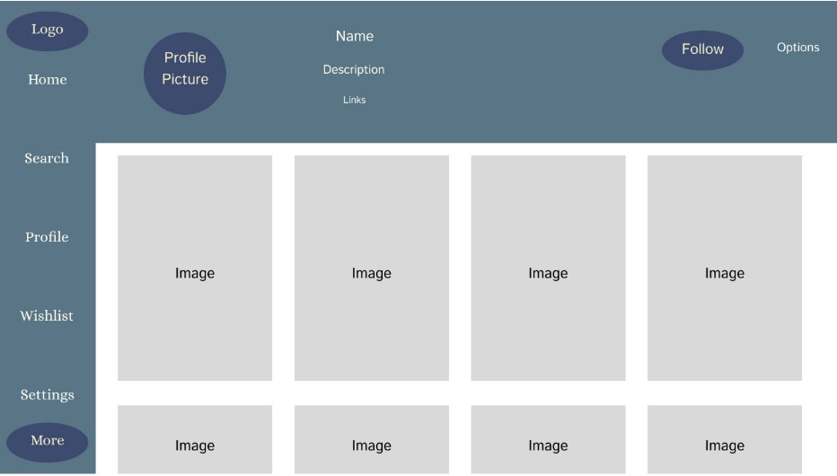

# 🎁 Giftly 

**Giftly** is a simplified wish list management app that helps users create, manage and share personalized wish lists for any occasion. By simplifying the process of giving and recieving gifts, Giftly ensures that every gift is meaningful and values to the user. 

---

## **📌 Deliverables**
For this deliverable, I completed the following:  
✅ **Built the application using React & Vite.**  
✅ **Better wishlist functionality with local storage.**  
✅ **Created a dedicated Wishlist page to manage saved gifts.**  
✅ **Encrypted user passwords with `bcryptjs` for security ^^.**  
✅ **Implemented "Forgot Password" feature for password reset.**  
✅ **Simon React deployed to production environment.**  

---

## **🚀 Elevator Pitch**
🎁 **Tired of guessing what gifts your loved ones want?**  
With **Giftly**, you can **create, manage, and share wish lists** effortlessly. Whether for birthdays, holidays, or special occasions, Giftly takes the stress out of gift-giving.

---

## **🎨 Design**
### **Main Page UI**

### **Search Page UI**

### **Wishlist Page UI**

---

## **✨ Key Features**
- **API-Driven Product Listing** – Fetches live products using a third-party API (currently not from Amazon yet ^^).  
- **Wish List Management** – Add, edit, and delete wish list items (Future it will saved on the users account uniquely).  
- **User Authentication** – Sign up and log in securely with encrypted passwords.  
- **Forgot Password Feature** – Reset passwords.  
- **Wishlist Page** – Users can now view and manage their wishlists in a wishlist page.  
- **Persistent Storage** – User data and wishlist items are stored even after logout.  
- **Database Storage (Planned)** – Store wish lists for easy access.  

---

## **🎀 CSS Enhancements**
✅ **Soft Pink Theme** – Aesthetic gradient background & deep pink accents.  
✅ **Stylish Navbar & Footer** – Sticky navigation & a polished footer design.  
✅ **Interactive Product Cards** – Transparent design, hover effects & shadows.  
✅ **Custom Buttons** – Rounded, animated buttons with smooth transitions.  
✅ **Responsive** – Optimized for mobile & desktop devices.  

---

## 📌 **React Phase 2: API & Wishlist Enhancements**  

For this deliverable, I implemented:  
✅ **API Integration** – Products are now loaded from an external API instead of hardcoded data.  
✅ **Wishlist Page** – A page for users to manage their saved gifts.  
✅ **Persistent Wishlist Storage** – Wishlist items are stored in `localStorage` so they remain after logout.  
✅ **Improved Authentication** –  
  - **Sign Up with Encrypted Passwords** (`bcryptjs`).  
  - **Login Verification** – Passwords are securely checked.  
  - **Forgot Password Feature** – Users can reset their passwords without an email.  
✅ **Bug Fixes & UI Improvements** –  
  - Improved responsiveness of product grids.  
  - Consistent button styles across the site.  

---

## **🛠️ Technologies Used**
| Technology | Purpose |
|------------|---------|
| **HTML** | Structured login, dashboard, and wish list pages. |
| **CSS & Bootstrap** | Created responsive UI. |
| **React.js** | Component-based UI framework |
| **Vite** | Fast builds and optimized performance |
| **bcryptjs** | Secure password encryption |
| **Caddy** | Web server for hosting |
| **AWS EC2** | Deployment and hosting |
| **Database & WebSockets (Planned)** | Real-time wish list updates & data storage from Amazon ^^. |  

---

## **🔗 Third-Party API Integration**
Giftly integrates with **[Fake Store API](https://fakestoreapi.com/)** to fetch real-time product data.  
Future integrations include **Amazon Product API** for adding real gifts directly to wish lists.

---

## **WebSocket**
I added WebSocket functionality to show real-time notifications when a user adds an item to their wishlist. This helps users see updates instantly without needing to refresh the page. A temporary WebSocket server is used for now, and it sends messages every time a wishlist is updated.

---

## **📎 Links & Resources**
🔗 **GitHub Repository:** [Giftly Repository](https://github.com/nandinnnnnnnnnnnn/Startup)  

---

## **💖 Made with Love by Nandintsetseg Batsaikhan**
🎀 _Gift-giving, made simple and magical!_ ✨  
