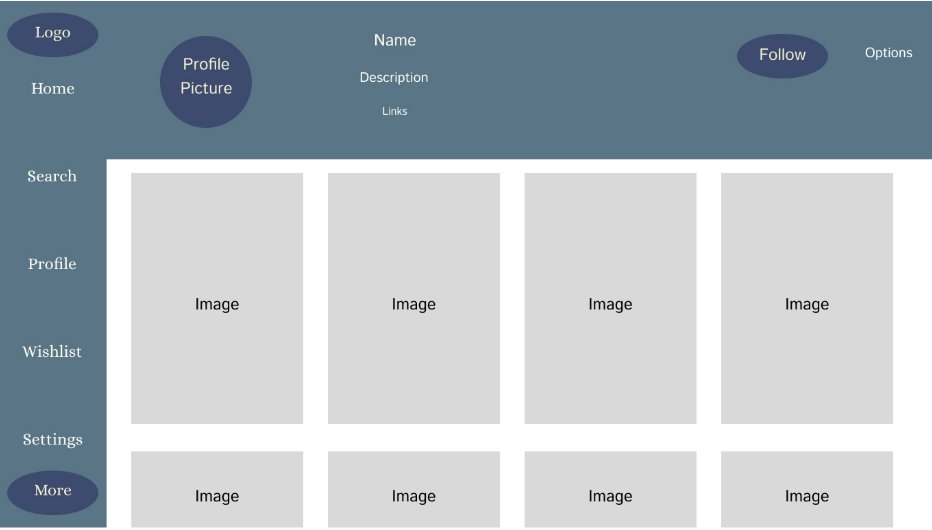
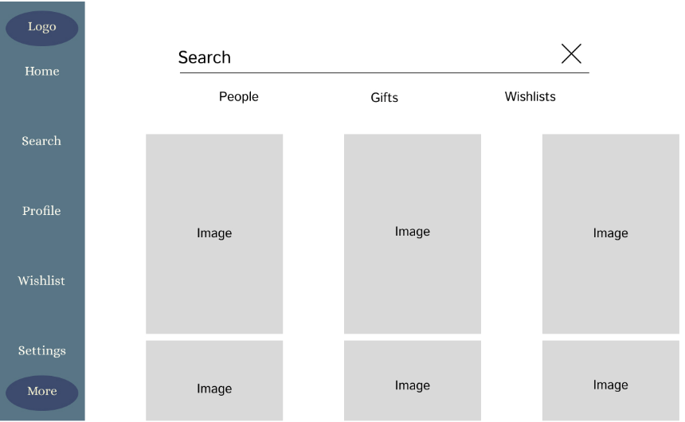

# Giftly 🎁

Giftly is a simplified wish list management app that helps users create, manage and share personalized wish lists for any occasion. By simplifying the process of giving and recieving gifts, Giftly ensures that every gift is meaningful and values to the user. 

## 🚀 Specification Deliverable

For this deliverable I did the following. I checked the box `[x]` and added a description for things I completed.

- [x] Proper use of Markdown
- [x] A concise and compelling elevator pitch
- [x] Description of key features
- [x] Description of how you will use each technology
- [x] One or more rough sketches of your application. Images must be embedded in this file using Markdown image references.

### Elevator pitch

Tired of guessing what gifts your loved ones want? With Giftly, you can create, manage, and share personalized wish lists for any occasion. Whether it’s birthdays, holidays, or just because, Giftly takes the stress out of gift-giving and makes it easy for everyone to give and receive meaningful presents.

### Design

### Key features

- User Authentication: Sign up and log in to access wish lists.

- Wish List Management: Add, edit, and delete wish list items.

- Sharing Made Simple: Generate sharable links for wish lists.

- Storage: Store wish lists in a database for easy access.

### Technologies

I am going to use the required technologies in the following ways.

- **HTML** - Structure the pages for login, dashboard, and wish list management. Semantic elements for improved accessibility.
- **CSS** -  Responsive styling and animations for buttons and modals to enhance user experience.
- **React** - Build reusable components for login forms, wish list items, and dashboards. Use React Router for navigation.
- **Service** -Provide backend endpoints for managing wish lists and user authentication.

- **DB/Login** - Store user accounts and wish lists, ensuring data security with encrypted credentials.
- **WebSocket** - Enable real-time notifications for shared wish list updates and display changes instantly.

###HTML Deliverable
For this deliverable, I built out the structure of my application using HTML.

- [x] **HTML Pages** - Multiple HTML pages representing the core structure:
  - `index.html`: Home page with an introduction and login form.
  - `wishlist.html`: Contains the wish list and cart functionality.
    - `about.html`: What our website is about.

- [x] **Links** - The login page links to the wish list page. The wish list page contains links to manage, add, or remove items.

- [x] **Text** - Each section includes a clear textual description of the app’s functionality, including login, wish list management, and real-time updates.

- [x] **Images** - Application includes relevant image on about.html

- [x] **DB/Login** - A login input form with a username and password field. The wish list represents stored data that will later be managed.

- [x] **WebSocket** - A real-time updates section to show when a user modifies a wish list or purchases an item.
